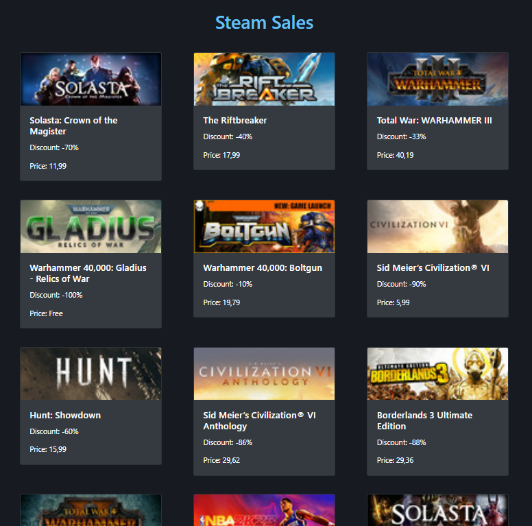

# Steam Sales Website

This is a simple Flask application that scrapes the Steam store's special sales page and displays the discounted games. The website uses BeautifulSoup to parse the HTML and requests library to send HTTP requests.

## Screenshot



## Setup and Installation

1. Clone this repository to your local machine.
2. Make sure you have Python installed (version 3.6 or higher).
3. Install the required dependencies by running the following command:

```bash
pip install flask beautifulsoup4
```

## Usage

1. Open a terminal and navigate to the project directory.
2. Run the Flask application using the following command:

```bash
python app.py
```

3. Open a web browser and go to `http://localhost:5000`.
4. You should see a list of Steam games on sale, including their titles, discounts, prices, and images.

## How It Works

The Flask application consists of a single route that renders the `sales.html` template. The template is passed the data retrieved from the `get_steam_sales` function.

The `get_steam_sales` function performs the following steps:

1. Sends an HTTP GET request to the Steam store's special sales page.
2. Parses the HTML response using BeautifulSoup.
3. Finds all game div elements with the class `responsive_search_name_combined`.
4. Extracts the game title, discount, price, and image URL from each div element.
5. Appends the game information to a list of sales dictionaries.
6. Returns the list of sales dictionaries.

## Contributing

Contributions to this project are welcome. If you find any issues or have suggestions for improvements, please open an issue or submit a pull request.

## License

This project is licensed under the [MIT License](LICENSE). Feel free to use and modify it as per the license terms.
